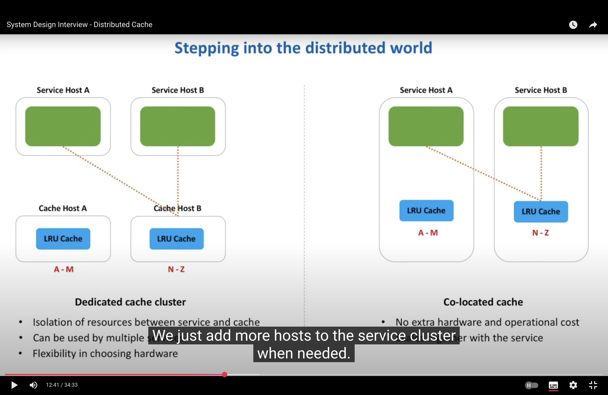
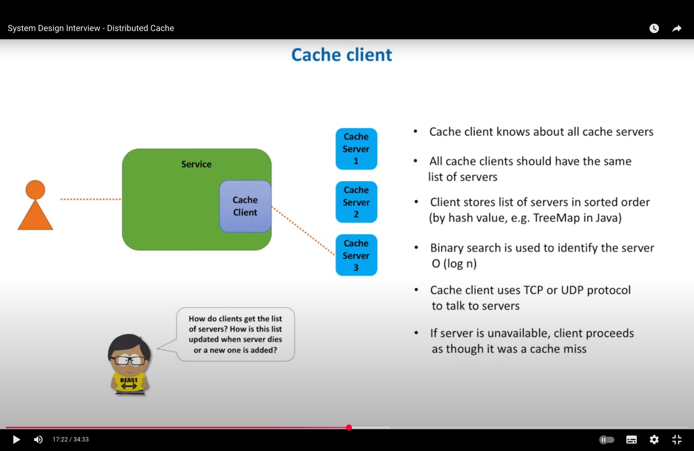
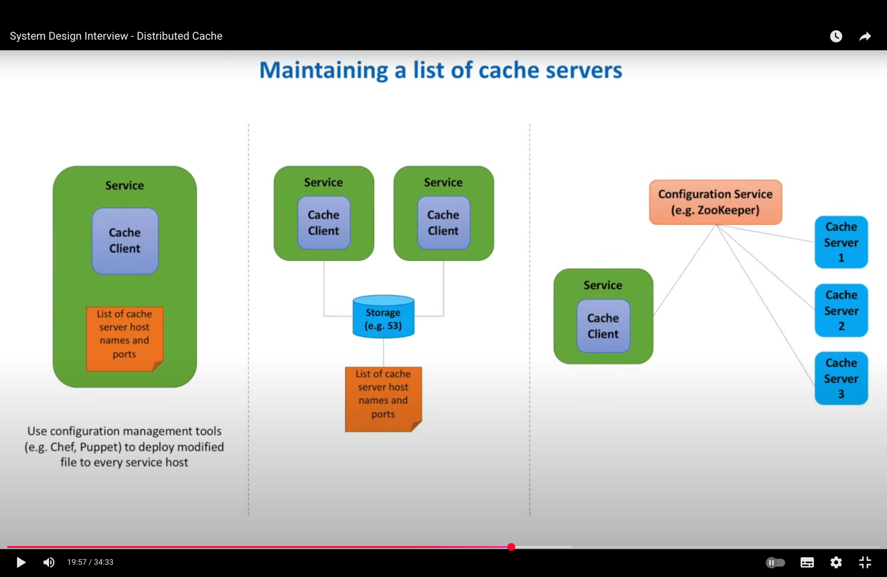
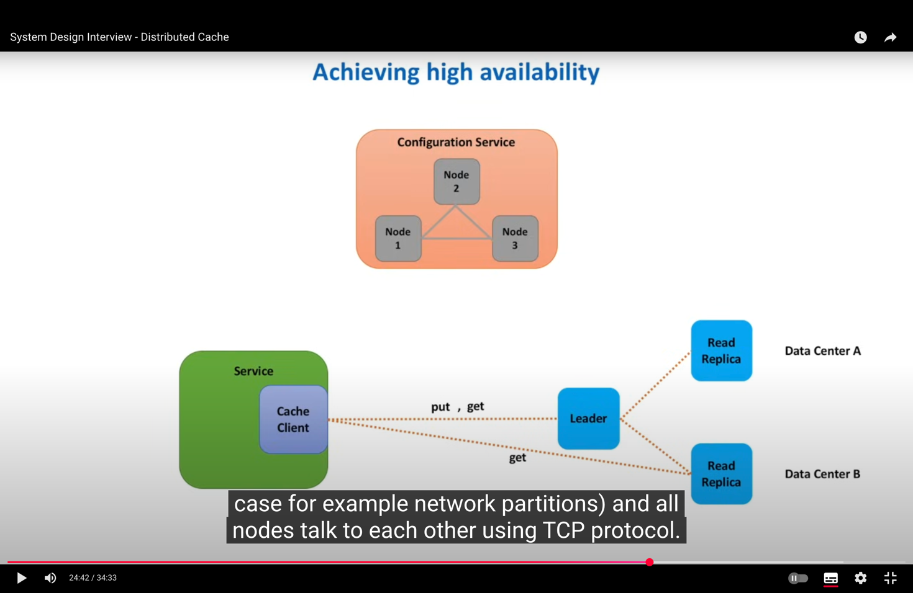

# Distributed Cache

### Problem Statement
- When a client sends a request to the web service, the service often queries the datastore.
- Queries to the datastore may take a long time or consume significant resources.
- This leads to slower response times for the client.

### Solution
- To improve performance, frequently accessed results are stored in an in-memory cache.
- When the client sends a request:
    1. The web service first checks the cache.
    2. If the data is available and valid (not stale), it is returned immediately.
    3. If the data is missing or outdated, the web service fetches it from the datastore, updates the cache, and then returns it to the client.

### Why Distributed Cache?
- If the dataset is too large or the application runs on multiple servers, a single local in-memory cache is not enough.
- A **distributed cache** shares cached data across servers, ensuring consistency and scalability.


# Requirements
### Functional
 - put(key, value)
 - get(key)

### Non-Functional
- **Scalable** → Should handle a large number of requests and store a large amount of cached data.
- **Highly Available** → Should survive hardware or network failures (ensures minimal cache misses).
- **Highly Performant** → Must support very fast writes (put) and reads (get).



# Choosing a Cache host
### Modular Hashing(naive approach)
``` plaintext
CacheHostNumber = HASH_Function(key)MOD NumberOfCacheHosts
```
- It is a simple and efficient approach to distribute data across servers
- The data is hashed using HashFunction, which returns a unique Value.
- This value is divided by number of servers. For example 100 data and 5 servers, all the data will be sent between the server 0 to 4.
- If servers are removed or added, there will be a cache miss and rehashing of the keys ⚠️
- Poor choice for production, suitable for testing

### Consistent Hashing
 - Consistent Hashing is the best choice for Distributed system to have availability and durability.

cache client is who calls the Cache servers




### First Strategy
 - Store the List of servers in each service host, manage using the Configuration management tools like Chef, puppet.
 - But Maintaining a consistency is difficult. ⚠️

### Second Strategy
 - Storing the list of servers in a centralized place like S3 Storage.
 - Services can poll on s3 and get list from it.
 - List of servers are manually deployed ⚠️

### Third Strategy
 - Use a Configuration Service (e.g., ZooKeeper) that maintains the list of cache servers.
 - The configuration manager performs periodic heartbeat checks to track server health.
 - Automatically updates the list of active cache servers.
 - Expensive ⚠️

# Higher Availability


- Put method on Master
- Get Method on Master and slave

### Concerns in Interview
 - when a cache client writes in master, different reads on master and slave ?
 - If Master has latest data and fails to transfer to slave nodes?
 - How do cache client picks the shard ?
- These are accepted behavior as cache needs to be highly available and fast.
- For first one , we can hide master/slave complexity behind a cache proxy .reads only from the master if strong consistency is required, or from replicas if we want low latency but can tolerate stale reads.
- If we do synchronous replication, writes become slower but safer. If we do async replication, we risk stale data but get higher performance.
- For third, we can have a proxy picks the shard for clients