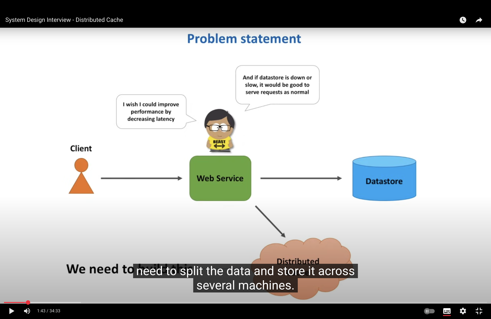

# Distributed Cache

### Problem Statement
- When a client sends a request to the web service, the service often queries the datastore.
- Queries to the datastore may take a long time or consume significant resources.
- This leads to slower response times for the client.

### Solution
- To improve performance, frequently accessed results are stored in an in-memory cache.
- When the client sends a request:
    1. The web service first checks the cache.
    2. If the data is available and valid (not stale), it is returned immediately.
    3. If the data is missing or outdated, the web service fetches it from the datastore, updates the cache, and then returns it to the client.

### Why Distributed Cache?
- If the dataset is too large or the application runs on multiple servers, a single local in-memory cache is not enough.
- A **distributed cache** shares cached data across servers, ensuring consistency and scalability.

# Requirements
### Functional
 - put(key, value)
 - get(key)

### Non-Functional
- **Scalable** → Should handle a large number of requests and store a large amount of cached data.
- **Highly Available** → Should survive hardware or network failures (ensures minimal cache misses).
- **Highly Performant** → Must support very fast writes (put) and reads (get).

